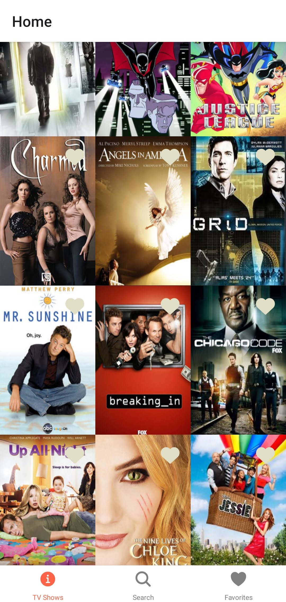
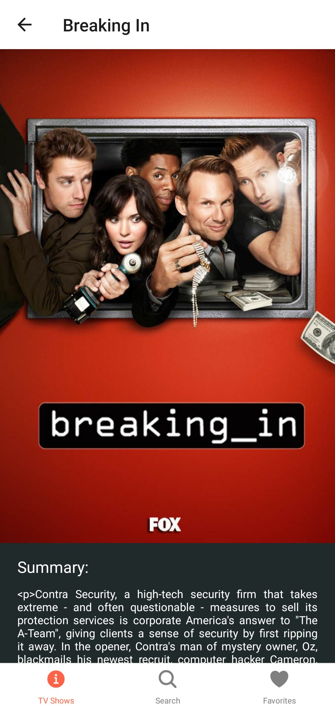
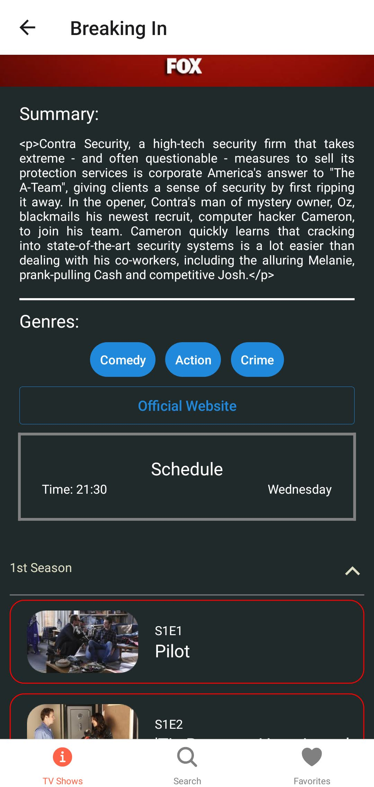
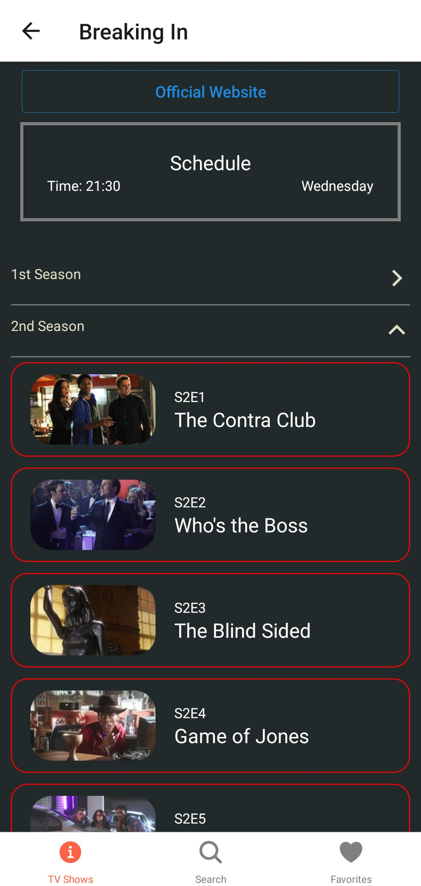
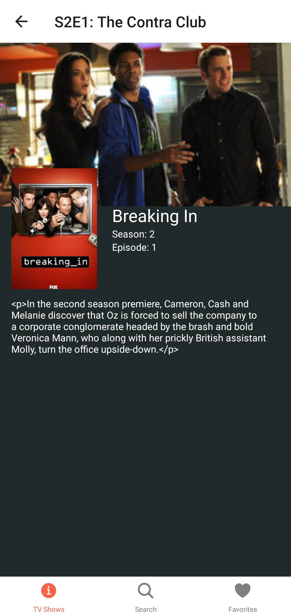
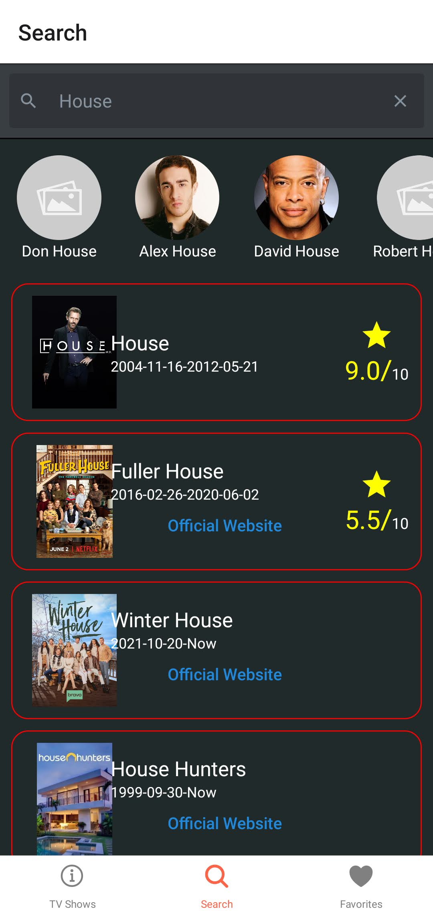
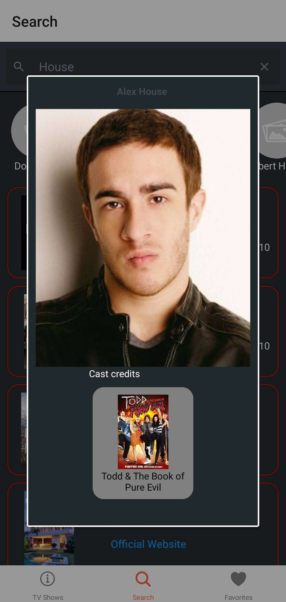
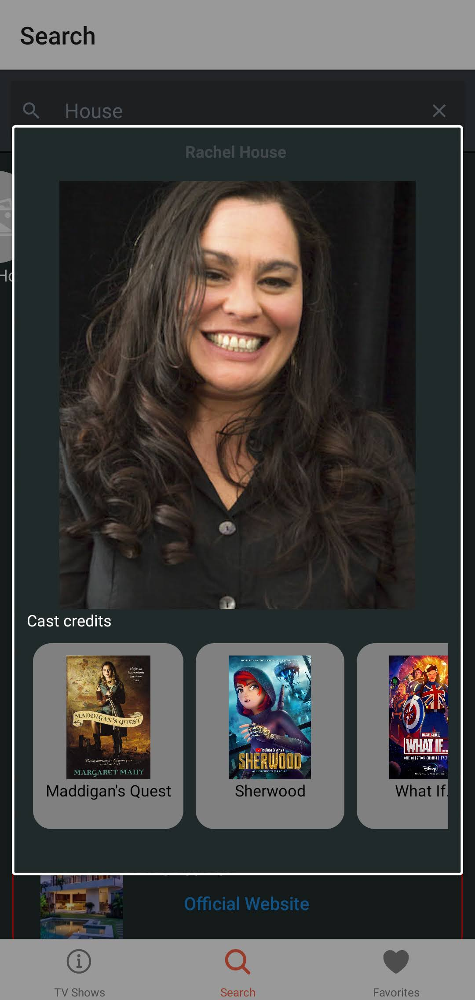

# Tv Series Mobile App

## Description
Project built on React native to listing TV series, using the API provided by the TVMaze
website.

## Setup instructions

1. Please check to have all requirements to run React Native Aplicacions https://reactnative.dev/docs/environment-setup
2. `npm install`
3. `npx react-native start`
4. `npx react-native run-android`

## App Screenshots
Home screen:
 

TV Show detail

TV Show detail part 2

Episode list

Episode Detail

Search screen

Person details

